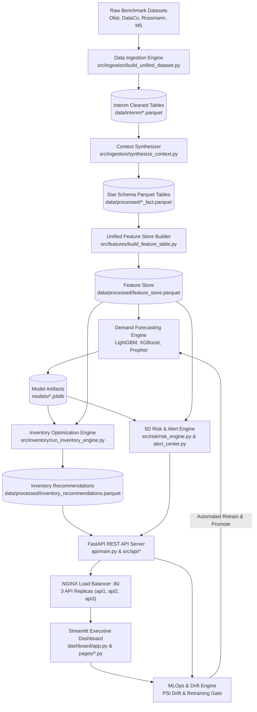

# Enterprise Supply Chain Demand Forecasting & Risk Intelligence Engine

[](https://www.python.org/)
[](https://fastapi.tiangolo.com/)
[](https://streamlit.io/)
[](LICENSE)

An enterprise-grade, AI-powered supply chain intelligence platform designed to forecast multi-horizon product demand, optimize inventory safety stock and reorder points, evaluate 5D operational supply chain risks, execute interactive scenario stress simulations, and automate MLOps model retraining.

---

## 🌟 Key Platform Capabilities

- **🔮 Multi-Horizon Demand Forecasting**: Gradient Boosted Trees (LightGBM, XGBoost) and Statistical Time Series (Prophet) benchmarked against Seasonal Naive (Lag 7) across 3 hierarchy levels (`sku_region`, `category_region`, `region_total`).
- **📦 Mathematical Inventory Optimization**: Automated Safety Stock ($SS = Z \cdot \sigma_d \cdot \sqrt{L}$), Reorder Points ($ROP = d \cdot L + SS$), and Economic Order Quantity ($EOQ = \sqrt{2DS/H}$).
- **⚠️ 5D Supply Chain Risk Engine**: Multi-dimensional risk scorecards covering Supplier Delay, Stockout Exposure, Overstock Capital, Slow-Moving/Dead Stock, and Demand Surge Anomalies.
- **🎮 Scenario Stress Simulator**: Interactive "what-if" sandbox simulating supplier delay shocks, price elasticity changes, promotional demand surges, product launches, transport delays, and macroeconomic demand shocks.
- **📊 Executive Dashboard & Alert Center**: API-First Streamlit dashboard with 7 focus modules, Plotly charts, and prioritized operational alerts across 6 categories (`LOW_INVENTORY`, `OVERSTOCK`, `DEMAND_SPIKE`, `SUPPLIER_DELAY`, `WAREHOUSE_CAPACITY`, `FORECAST_DRIFT`).
- **⚡ MLOps & Automated Retraining**: Model registry (`Staging` $\leftrightarrow$ `Production`), Population Stability Index (PSI) feature drift detection, rolling error degradation tracking, real-time latency monitoring, and strict holdout promotion gates.
- **🚢 High-Availability Deployment**: Docker Compose (`docker-compose.prod.yml`) and Kubernetes (`k8s/`) manifests featuring 3 API replicas behind an NGINX load balancer with automatic failover.

---

## 🏗️ System Architecture



---

## 📁 Repository Directory Structure

```
ML-021/
├── api/                    # FastAPI entrypoint application (api/main.py)
├── dashboard/              # Executive Dashboard & Multi-Page Modules
│   ├── app.py              # Main Streamlit landing hub
│   ├── api_client.py       # REST API HTTP client with X-API-Key auth
│   └── pages/              # 7 Focus Module Pages
│       ├── kpi_overview.py
│       ├── forecast_accuracy.py
│       ├── inventory_health.py
│       ├── warehouse_utilization.py
│       ├── fill_rate_stockout.py
│       ├── procurement_recommendations.py
│       └── alert_center.py
├── data/                   # Pipeline Data Storage Stages
│   ├── raw/                # Original benchmark datasets
│   ├── interim/            # Cleaned interim parquet tables
│   └── processed/          # Unified feature store & star schema tables
├── docs/                   # Complete Platform System Documentation Hub
│   ├── index.md            # Master sitemap index
│   ├── architecture_diagram.md
│   ├── api_spec.md
│   ├── data_model.md
│   ├── deployment_guide.md
│   ├── mlops_policy.md
│   ├── known_limitations.md
│   ├── dashboard_stack.md
│   ├── dataset_profile.md
│   ├── eda_findings.md
│   ├── model_plan.md
│   ├── model_evaluation_report.md
│   ├── phase_12_supply_chain_risk_engine.md
│   ├── phase_13_scenario_simulation.md
│   ├── pipeline_run_log.md
│   ├── requirements.md
│   ├── out_of_scope.md
│   └── traceability.md
├── k8s/                    # Kubernetes Production Manifests
├── models/                 # Serialized model artifacts & registry logs
├── nginx/                  # NGINX reverse proxy & load balancer config
├── scripts/                # Verification & diagnostic scripts
├── src/                    # Core Python Source Package
│   ├── api/                # REST API routers (risk, inventory, simulation, mlops, alerts)
│   ├── features/           # Feature engineering pipelines (9 domain feature sets)
│   ├── forecasting/        # Demand forecasting predictors, CV & evaluators
│   ├── ingestion/          # ETL data cleaning & context synthesizers
│   ├── inventory/          # Safety stock, ROP, and EOQ calculators
│   ├── mlops/              # Model registry, PSI drift, monitoring & retraining
│   ├── risk/               # 5D Risk Engine & Alert Center
│   ├── simulation/         # Scenario stress-test sandbox
│   └── utils/              # Logging & database connection utilities
├── tests/                  # Automated Pytest Suite
├── .env.example            # Local environment configuration template
├── .env.prod.example       # Production secret reference template
├── docker-compose.yml      # Local development compose configuration
├── docker-compose.prod.yml # Production HA compose configuration
├── Dockerfile              # Service container image definition
├── Makefile                # Command shortcuts (up, down, test, run)
└── requirements.txt        # Python dependencies manifest
```

---

## 🚀 Quickstart Guide

### 1. Prerequisites
- **Python**: 3.11, 3.12, or 3.13
- **Docker**: Engine 24.0+ & Docker Compose v2+ (for containerized deployment)

### 2. Local Environment Setup
Clone the repository, create a virtual environment, and install dependencies:
```bash
# 1. Clone repository
git clone https://github.com/organization/ML-021.git
cd ML-021

# 2. Create virtual environment
python -m venv venv
source venv/bin/activate  # On Windows: venv\Scripts\activate

# 3. Install required Python packages
pip install -r requirements.txt

# 4. Initialize environment variables
cp .env.example .env
```

### 3. Run Data Ingestion & Build Feature Store
Process benchmark datasets, synthesize context, and assemble the time-series feature store:
```bash
# 1. Clean raw benchmark datasets into interim parquet files
python -m src.ingestion.build_unified_dataset

# 2. Synthesize context (weather, promotions, events) into Star Schema tables
python -m src.ingestion.synthesize_context

# 3. Build unified feature store
python -m src.features.build_feature_table
```

### 4. Train Forecasting Models & Compute Inventory Recommendations
Train GBDT and statistical models and generate optimized safety stock / ROP recommendations:
```bash
# 1. Train LightGBM forecasting models
python -m src.forecasting.train_lightgbm

# 2. Evaluate model benchmarks against seasonal naive baselines
python -m src.forecasting.evaluate

# 3. Run inventory optimization engine (SS, ROP, EOQ)
python -m src.inventory.run_inventory_engine
```

### 5. Start the FastAPI Backend Server
Launch the REST API server on port 8000:
```bash
uvicorn api.main:app --reload --port 8000
```
- **Swagger Interactive API Documentation**: [http://localhost:8000/docs](http://localhost:8000/docs)
- **Service Health Endpoint**: [http://localhost:8000/health](http://localhost:8000/health)

### 6. Launch the Executive Streamlit Dashboard
In a separate terminal, launch the Streamlit Executive Dashboard:
```bash
streamlit run dashboard/app.py
```
- **Dashboard Web UI**: [http://localhost:8501](http://localhost:8501)

---

## 🐳 Production Deployment (High Availability)

To launch the full production stack featuring 3 API replicas behind an NGINX load balancer, Streamlit dashboard, MLflow, PostgreSQL, and Redis:

```bash
# 1. Copy production environment file
cp .env.prod.example .env.prod

# 2. Launch production stack with Docker Compose
docker compose -f docker-compose.prod.yml --env-file .env.prod up -d --build
```

Access production endpoints:
- **NGINX Load Balancer & API Gateway**: [http://localhost:80](http://localhost:80)
- **Streamlit Executive Dashboard**: [http://localhost:8501](http://localhost:8501)

*(For detailed Kubernetes deployment and failover procedures, see [`docs/deployment_guide.md`](docs/deployment_guide.md)).*

---

## 🧪 Running Automated Tests

Run the complete pytest test suite across all engines:
```bash
python -m pytest
```

Run specific test modules:
```bash
# API Endpoint Tests
python -m pytest tests/test_api_endpoints.py

# 5D Risk Engine Tests
python -m pytest tests/test_risk_engine.py

# Inventory Formulas Tests
python -m pytest tests/test_inventory_formulas.py

# MLOps & Drift Detector Tests
python -m pytest tests/test_mlops.py
```

---

## 📚 Complete Platform Documentation Index

All platform technical documentation is consolidated in the [`docs/`](docs/) directory:

| Document | Description |
|---|---|
| 🗺️ [`docs/index.md`](docs/index.md) | **Master Platform Sitemap & Documentation Index** |
| 🏗️ [`docs/architecture_diagram.md`](docs/architecture_diagram.md) | Mermaid System Architecture & Technical Data Flow |
| 🔌 [`docs/api_spec.md`](docs/api_spec.md) | REST API OpenAPI Specifications & Authentication |
| 📐 [`docs/data_model.md`](docs/data_model.md) | Star Schema Entity-Relationship Data Model |
| 🚢 [`docs/deployment_guide.md`](docs/deployment_guide.md) | High-Availability Production & Kubernetes Operations |
| ⚡ [`docs/mlops_policy.md`](docs/mlops_policy.md) | MLOps Model Registry, PSI Drift & Retraining Policy |
| ⚠️ [`docs/known_limitations.md`](docs/known_limitations.md) | Prototype Caveats, Synthetic Data Notes & Roadmap |
| 🖥️ [`docs/dashboard_stack.md`](docs/dashboard_stack.md) | Streamlit Executive Dashboard Architecture & Rules |
| 📊 [`docs/dataset_profile.md`](docs/dataset_profile.md) | Benchmark Dataset Profiles (Olist, DataCo, Rossmann, M5) |
| 🔍 [`docs/eda_findings.md`](docs/eda_findings.md) | Exploratory Data Analysis & Demand Pattern Insights |
| 🔮 [`docs/model_plan.md`](docs/model_plan.md) | Demand Forecasting Model Selection & Training Strategy |
| 📈 [`docs/model_evaluation_report.md`](docs/model_evaluation_report.md) | Model Performance Metrics, Baselines & SHAP Importance |
| ⚠️ [`docs/phase_12_supply_chain_risk_engine.md`](docs/phase_12_supply_chain_risk_engine.md) | 5D Supply Chain Risk Engine Technical Specification |
| 🎮 [`docs/phase_13_scenario_simulation.md`](docs/phase_13_scenario_simulation.md) | Scenario Stress Simulator Specification & Shock Parameters |
| 📜 [`docs/pipeline_run_log.md`](docs/pipeline_run_log.md) | Operational Execution Log for Data & Model Pipelines |
| 📋 [`docs/requirements.md`](docs/requirements.md) | Platform Functional & Non-Functional System Requirements |
| ⛔ [`docs/out_of_scope.md`](docs/out_of_scope.md) | Project Boundaries & Explicitly Excluded Scopes |
| 🎯 [`docs/traceability.md`](docs/traceability.md) | Requirements Traceability Matrix across Code and Tests |
