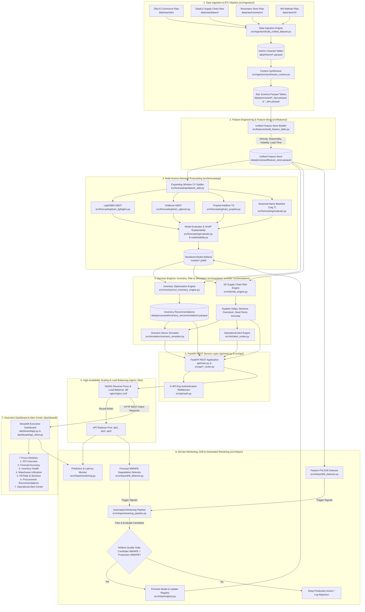

# System Architecture Diagram & Technical Data Flow

This document presents the complete system architecture, module interactions, data transformation pipeline, and MLOps feedback loop for the **Enterprise Supply Chain Demand Forecasting & Risk Intelligence Engine**, verified against the physical source code structure.

---

## 1. End-to-End System Architecture Flowchart (Mermaid)

---

## 2. Technical Data Flow & Module Architecture

### 1. Data Ingestion & Context Synthesis (`src/ingestion/`)
- **Raw Ingestion** (`build_unified_dataset.py`): Ingests 4 benchmark datasets from `data/raw/` (Olist E-Commerce, DataCo Supply Chain, Rossmann Store, M5 Walmart), cleans column schemas, parses dates, and outputs cleaned interim parquet files in `data/interim/`.
- **Context Synthesizer** (`synthesize_context.py`): Enriches interim tables with weather indicators, promotional campaigns, and regional events, outputting a Star Schema data model (`sales_fact.parquet`, `product_dim.parquet`, `supplier_dim.parquet`, `warehouse_dim.parquet`, `calendar_dim.parquet`) in `data/processed/`.

### 2. Feature Engineering & Unified Feature Store (`src/features/`)
- **Feature Pipeline** (`build_feature_table.py`): Assembles 9 domain-specific feature groups:
  1. `sales_velocity.py`: Short-term and long-term moving averages, velocity trends.
  2. `demand_seasonality.py`: Day-of-week, month, quarter, and Fourier cyclical features.
  3. `volatility_metrics.py`: Demand coefficient of variation ($CV$), rolling standard deviation.
  4. `lead_time_features.py`: Historical lead time mean and standard deviation.
  5. `supplier_reliability.py`: On-time delivery rates, late delivery frequencies.
  6. `promotion_impact.py`: Discount depth, active campaign flags.
  7. `product_lifecycle.py`: Days since launch, zero-sales week counters.
  8. `regional_demand.py`: Regional aggregation and warehouse level demand ratios.
  9. `holiday_effects.py`: Proximity counters to past/future holidays and weather metrics.
- Output is stored as a single optimized parquet table at `data/processed/feature_store.parquet`.

### 3. Demand Forecasting & Evaluation Engine (`src/forecasting/`)
- **Expanding Window Cross-Validation** (`dataset_split.py`): Splits time-series features across temporal cutoffs to prevent data leakage.
- **Model Algorithms**: GBDT architectures (`train_lightgbm.py`, `train_xgboost.py`) and additive time-series models (`train_prophet.py`) trained across 3 hierarchy levels (`sku_region`, `category_region`, `region_total`).
- **Evaluation & SHAP** (`evaluate.py`, `explainability.py`): Computes WMAPE, MAE, RMSE, MAPE, and Bias against Seasonal Naive (Lag 7) baselines and extracts SHAP feature importance values. Serialized binaries are stored in `models/*.joblib`.

### 4. Inventory Optimization & 5D Risk Engine (`src/inventory/`, `src/risk/`)
- **Inventory Engine** (`run_inventory_engine.py`, `safety_stock.py`): Computes mathematical Safety Stock ($SS = Z \cdot \sigma_d \cdot \sqrt{L}$), Reorder Points ($ROP = d \cdot L + SS$), and Economic Order Quantity ($EOQ = \sqrt{2DS/H}$), outputting `data/processed/inventory_recommendations.parquet`.
- **5D Risk Engine** (`risk_engine.py`): Evaluates 5 operational risk dimensions:
  - Supplier Delay Risk (`supplier_delay_risk.py`)
  - Stockout Exposure Risk (`stockout_risk.py`)
  - Overstock Capital Risk (`overstock_risk.py`)
  - Slow-Moving / Dead Stock Risk (`inventory_health_risk.py`)
  - Demand Anomaly Risk (`demand_anomaly_risk.py`)
- **Alert Engine** (`alert_center.py`): Generates prioritized alerts across 6 operational risk categories.

### 5. Scenario Stress Simulator (`src/simulation/`)
- **Scenario Simulator** (`scenario_simulator.py`): Executes interactive "what-if" stress testing for 6 supply chain shock scenarios:
  1. Supplier Failure / Lead Time Delay (`supplier_failure.py`)
  2. Price Increase & Elasticity (`price_increase.py`)
  3. Holiday Sales Surge (`holiday_sales.py`)
  4. New Product Launch Ramp (`new_product_launch.py`)
  5. Regional Transport Disruption (`transport_delay.py`)
  6. Macroeconomic Demand Surge (`demand_surge.py`)

### 6. REST API Service Layer & High Availability (`api/`, `src/api/`, `nginx/`)
- **FastAPI Application** (`api/main.py`): Exposes RESTful endpoints organized into 5 domain routers (`risk_router.py`, `inventory_router.py`, `simulation_router.py`, `mlops_router.py`, `alerts_router.py`).
- **Security Middleware** (`auth.py`): Enforces `X-API-Key` authentication headers across protected routes.
- **HA Scaling** (`nginx/nginx.conf`, `docker-compose.prod.yml`): NGINX load balancer distributes incoming HTTP traffic across a pool of 3 API container replicas (`api1`, `api2`, `api3`).

### 7. Executive Dashboard & Alert Center (`dashboard/`)
- **Streamlit Application** (`dashboard/app.py`, `api_client.py`): Multi-page executive UI adhering strictly to API-First design rules (0 direct database reads).
- **Focus Modules**: 7 dedicated pages (`pages/*.py`) displaying executive KPIs, forecast accuracy plots, inventory health gauges, warehouse capacity metrics, fill rate curves, procurement recommendations, and interactive operational alert feeds.

### 8. MLOps & Automated Retraining Loop (`src/mlops/`)
- **Drift & Degradation Detection** (`drift_detector.py`): Calculates feature Population Stability Index ($\text{PSI} \ge 0.25$) and monitors forecast WMAPE error degradation ($\ge 20\%$).
- **Automated Retraining** (`retraining_pipeline.py`, `registry.py`): Triggers unattended retraining and evaluates candidate model quality on holdout validation data. If candidate WMAPE improves upon production WMAPE, the candidate is automatically promoted in the model registry.
