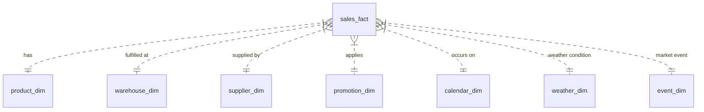

# Unified Enterprise Data Model Specification

## 1. Overview
This document defines the schema for the 8 core unified tables in the Enterprise Supply Chain Platform. The data model harmonizes raw data from four heterogeneous sources (**Olist**, **DataCo**, **Rossmann**, and **M5 Walmart**) into a standardized relational/dimensional enterprise schema.

---

## 2. Table Specifications

### 2.1 `sales_fact` (Central Fact Table)
Stores transactional sales records aggregated or itemized from all 4 datasets.

| Column Name | Data Type | Key Type | Description | Source Mapping |
| :--- | :--- | :--- | :--- | :--- |
| `sales_id` | `VARCHAR(128)` | **PK** | Unique sales line/transaction identifier | `{source}_{order_id}_{item_id}` |
| `dataset_source` | `VARCHAR(32)` | | Source dataset identifier (`olist`, `dataco`, `rossmann`, `m5`) | Fixed string per loader |
| `date` | `TIMESTAMP` | **FK** | Transaction purchase date | Source date field parsed to ISO format |
| `product_id` | `VARCHAR(128)` | **FK** | Foreign key to `product_dim` | Source product ID mapped to standard |
| `warehouse_id` | `VARCHAR(128)` | **FK** | Foreign key to `warehouse_dim` | Source store/seller/region warehouse ID |
| `supplier_id` | `VARCHAR(128)` | **FK** | Foreign key to `supplier_dim` | Source seller/department supplier ID |
| `promotion_id` | `VARCHAR(128)` | **FK** | Foreign key to `promotion_dim` | Mapped promo ID or `promo_none` |
| `region` | `VARCHAR(64)` | | Regional market code / state | Source state or region |
| `quantity` | `FLOAT64` | | Quantity sold | Item count / customer count / 1.0 |
| `unit_price` | `FLOAT64` | | Price per unit item | Item price / unit price |
| `total_sales` | `FLOAT64` | | Total gross revenue from transaction | `quantity * unit_price` or gross sales |
| `discount_amount`| `FLOAT64` | | Monetary value of applied discount | Source discount or 0.0 |
| `shipping_cost`  | `FLOAT64` | | Freight / shipping fee | Source freight value or 0.0 |
| `profit`         | `FLOAT64` | | Net profit / benefit per order | Source benefit/profit or 0.0 |

---

### 2.2 `product_dim` (Product Dimension)
Unified product catalog attributes.

| Column Name | Data Type | Key Type | Description |
| :--- | :--- | :--- | :--- |
| `product_id` | `VARCHAR(128)` | **PK** | Unique product identifier |
| `product_name` | `VARCHAR(256)` | | Product display name or translated category |
| `category` | `VARCHAR(128)` | | High-level product category |
| `sub_category` | `VARCHAR(128)` | | Detailed sub-category or department |
| `unit_cost` | `FLOAT64` | | Estimated unit cost / list price baseline |
| `weight_g` | `FLOAT64` | | Product weight in grams (0.0 if omitted) |
| `dataset_source`| `VARCHAR(32)` | | Source dataset identifier |

---

### 2.3 `warehouse_dim` (Warehouse / Store Dimension)
Fulfillment centers, warehouses, and retail store locations.

| Column Name | Data Type | Key Type | Description |
| :--- | :--- | :--- | :--- |
| `warehouse_id` | `VARCHAR(128)` | **PK** | Unique warehouse/store identifier |
| `warehouse_name`| `VARCHAR(256)` | | Display name of warehouse / store |
| `region` | `VARCHAR(64)` | | Geographic operating region / state |
| `city` | `VARCHAR(128)` | | City location |
| `country` | `VARCHAR(64)` | | Country |
| `capacity_units`| `INT64` | | Estimated storage capacity in units |
| `dataset_source`| `VARCHAR(32)` | | Source dataset identifier |

---

### 2.4 `supplier_dim` (Supplier / Seller Dimension)
Suppliers, sellers, and internal department vendors.

| Column Name | Data Type | Key Type | Description |
| :--- | :--- | :--- | :--- |
| `supplier_id` | `VARCHAR(128)` | **PK** | Unique supplier/seller identifier |
| `supplier_name` | `VARCHAR(256)` | | Supplier display name / business title |
| `region` | `VARCHAR(64)` | | Region / state of supplier |
| `city` | `VARCHAR(128)` | | Operating city |
| `country` | `VARCHAR(64)` | | Country |
| `lead_time_days`| `INT64` | | Estimated average replenishment lead time |
| `reliability_score`| `FLOAT64` | | Reliability rating score (1.0 to 5.0) |
| `dataset_source`| `VARCHAR(32)` | | Source dataset identifier |

---

### 2.5 `promotion_dim` (Promotion Dimension)
Promotional campaign metadata.

| Column Name | Data Type | Key Type | Description |
| :--- | :--- | :--- | :--- |
| `promotion_id` | `VARCHAR(128)` | **PK** | Unique promotion identifier |
| `promo_name` | `VARCHAR(256)` | | Promotion display name |
| `discount_type` | `VARCHAR(64)` | | Type (`none`, `percentage`, `fixed`, `flag`) |
| `discount_percent`| `FLOAT64` | | Discount percentage multiplier (0.0 to 1.0) |
| `is_active` | `BOOLEAN` | | Whether promotion is active |
| `dataset_source`| `VARCHAR(32)` | | Source dataset identifier |

---

### 2.6 `calendar_dim` (Calendar Dimension)
Standard enterprise date dimension table covering transaction date ranges.

| Column Name | Data Type | Key Type | Description |
| :--- | :--- | :--- | :--- |
| `date` | `TIMESTAMP` | **PK** | Calendar date |
| `year` | `INT64` | | Calendar year (e.g. 2015) |
| `quarter` | `INT64` | | Calendar quarter (1-4) |
| `month` | `INT64` | | Month of year (1-12) |
| `day` | `INT64` | | Day of month (1-31) |
| `day_of_week` | `INT64` | | Day of week (0=Monday, 6=Sunday) |
| `week_of_year` | `INT64` | | ISO week number (1-53) |
| `is_weekend` | `BOOLEAN` | | True if Saturday or Sunday |
| `is_holiday` | `BOOLEAN` | | True if public holiday |

---

### 2.7 `weather_dim` (Contextual Weather Dimension)
Contextual weather parameters (synthetically generated and flagged).

| Column Name | Data Type | Key Type | Description |
| :--- | :--- | :--- | :--- |
| `weather_id` | `VARCHAR(128)` | **PK** | Composite `{region}_{date_str}` |
| `date` | `TIMESTAMP` | **FK** | Date |
| `region` | `VARCHAR(64)` | | Region |
| `temperature_c` | `FLOAT64` | | Temperature in Celsius |
| `precipitation_mm`| `FLOAT64` | | Daily precipitation in mm |
| `humidity_pct` | `FLOAT64` | | Humidity percentage |
| `weather_condition`| `VARCHAR(64)`| | Category (`Sunny`, `Rainy`, `Cloudy`, `Snowy`) |
| `is_synthetic` | `BOOLEAN` | | Synthetic flag (Always `True`) |

---

### 2.8 `event_dim` (Contextual Event Dimension)
Contextual market and calendar events (synthetically generated and flagged).

| Column Name | Data Type | Key Type | Description |
| :--- | :--- | :--- | :--- |
| `event_id` | `VARCHAR(128)` | **PK** | Composite `{region}_{date_str}_{event_name}` |
| `date` | `TIMESTAMP` | **FK** | Date |
| `region` | `VARCHAR(64)` | | Region |
| `event_name` | `VARCHAR(128)` | | Name of event |
| `event_type` | `VARCHAR(64)` | | Category (`Holiday`, `Sports`, `Cultural`, `Commercial`) |
| `impact_score` | `FLOAT64` | | Demand impact multiplier (1.0 - 2.5) |
| `is_synthetic` | `BOOLEAN` | | Synthetic flag (Always `True`) |

---

## 3. Entity-Relationship Diagram

