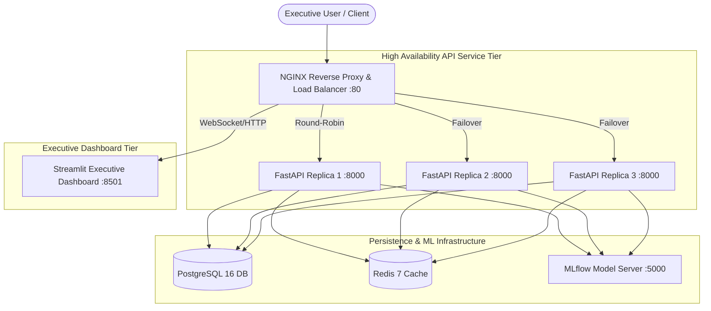

# Production Deployment Guide: High Availability & Horizontal Scaling

This guide provides step-by-step instructions for building, packaging, deploying, scaling, and managing the **Enterprise Supply Chain Demand Forecasting & Risk Platform** in a production environment.

---

## 1. System Architecture & High Availability (HA) Design

The platform uses a fully containerized, decoupled microservice architecture. The API tier is horizontally scaled across multiple active replicas (`api1`, `api2`, `api3`) behind an NGINX reverse proxy and round-robin load balancer.



---

## 2. Infrastructure Prerequisites

Before deploying to a production server or cluster, ensure the host machine meets the following prerequisites:

| Requirement | Minimum Specification | Recommended Production Spec |
|---|---|---|
| **Operating System** | Linux (Ubuntu 22.04 LTS / RHEL 9 / Debian 12) | Linux Kernel 5.15+ LTS |
| **CPU Cores** | 4 vCPU | 8+ vCPU |
| **RAM** | 8 GB | 16 GB+ |
| **Storage** | 40 GB NVMe / SSD | 100 GB+ NVMe SSD |
| **Container Engine** | Docker 24.0+ | Docker Engine 25.0+ |
| **Orchestration Tool** | Docker Compose v2.20+ | Docker Compose v2.24+ or Kubernetes 1.28+ |

---

## 3. Environment Variable & Secrets Configuration

To comply with enterprise security standards, **no plaintext secrets are committed to the repository**. All configuration settings use environment variable references loaded from `.env.prod`.

### Required Environment Variables Matrix:

| Variable Name | Description | Default / Example Value | Secret (Y/N) |
|---|---|---|---|
| `ENVIRONMENT` | Target execution environment | `production` | N |
| `LOG_LEVEL` | Application logging verbosity | `INFO` | N |
| `API_KEY` | Secret token for FastAPI `X-API-Key` auth | `openssl rand -hex 32` | **Y** |
| `POSTGRES_HOST` | PostgreSQL host address | `postgres` | N |
| `POSTGRES_PORT` | PostgreSQL port | `5432` | N |
| `POSTGRES_DB` | Production database name | `supply_chain_prod` | N |
| `POSTGRES_USER` | Production database admin user | `supply_admin` | N |
| `POSTGRES_PASSWORD` | PostgreSQL database password | *Strong Generated Password* | **Y** |
| `REDIS_HOST` | Redis cache hostname | `redis` | N |
| `REDIS_PORT` | Redis cache port | `6379` | N |
| `REDIS_PASSWORD` | Redis authentication password | *Strong Generated Password* | **Y** |
| `MLFLOW_TRACKING_URI` | MLflow tracking server URI | `http://mlflow:5000` | N |
| `API_BASE_URL` | NGINX load balanced API gateway URL | `http://nginx:80` | N |

---

## 4. Enterprise Secrets Management Integration Path

For enterprise deployments (AWS, Azure, GCP, or On-Premises), static `.env` files should be replaced with a dynamic Secrets Manager:

### A. HashiCorp Vault Integration
1. Store secrets in Vault under path `secret/data/supply-chain/production`.
2. Use Vault Agent / Sidecar Injector to dynamically inject secrets into container environment variables at runtime.

### B. AWS Secrets Manager / Azure Key Vault
1. Fetch secrets during container startup script using AWS CLI / Azure Identity SDK:
   ```bash
   export API_KEY=$(aws secretsmanager get-secret-value --secret-id prod/API_KEY --query SecretString --output text)
   ```

### C. Kubernetes Secrets & External Secrets Operator (ESO)
1. Use External Secrets Operator (ESO) to sync secrets from AWS Secrets Manager or HashiCorp Vault directly into Kubernetes `Secret` objects in namespace `supply-chain`.

---

## 5. Step-by-Step Production Deployment Walkthrough

### Step 1: Environment File Setup
Clone the repository and copy the environment template:
```bash
cd ML-021
cp .env.prod.example .env.prod
```
Edit `.env.prod` to populate strong production passwords and secret API keys:
```bash
# Example secret generation command:
openssl rand -hex 32
```

### Step 2: Build & Launch High-Availability Stack
Run Docker Compose with the production configuration file:
```bash
docker compose -f docker-compose.prod.yml --env-file .env.prod up -d --build
```

### Step 3: Verify Container Health Status
Verify that all 8 containers (`postgres`, `redis`, `mlflow`, `api1`, `api2`, `api3`, `dashboard`, `nginx`) report healthy:
```bash
docker compose -f docker-compose.prod.yml ps
```
*Expected Output*:
```
NAME                          COMMAND                  SERVICE      STATUS
supply_chain_postgres_prod    "docker-entrypoint.s…"   postgres     healthy
supply_chain_redis_prod       "docker-entrypoint.s…"   redis        healthy
supply_chain_mlflow_prod      "mlflow server --hos…"   mlflow       healthy
supply_chain_api_1            "uvicorn api.main:ap…"   api1         healthy
supply_chain_api_2            "uvicorn api.main:ap…"   api2         healthy
supply_chain_api_3            "uvicorn api.main:ap…"   api3         healthy
supply_chain_dashboard_prod   "streamlit run dashb…"   dashboard    healthy
supply_chain_nginx_prod       "/docker-entrypoint.…"   nginx        healthy
```

### Step 4: Validate Load Balancer Health Endpoint
Query the NGINX load balancer to verify endpoint routing across API replicas:
```bash
curl -i http://localhost/health
```
*Response*:
```json
HTTP/1.1 200 OK
Server: nginx/1.25.4
Content-Type: application/json

{"status":"healthy","service":"supply-chain-api","version":"1.0.0"}
```

---

## 6. High Availability & Fault Tolerance Verification

To prove zero-downtime fault tolerance, simulate a failure by killing one of the API replicas:

```bash
# 1. Stop API Replica 1
docker stop supply_chain_api_1

# 2. Immediately execute request against load balancer
curl -i http://localhost/health
```

**Result**: NGINX detects `api1` is offline (`max_fails=2 fail_timeout=5s`) and automatically proxies incoming traffic to live healthy replicas (`api2`, `api3`) with **0ms downtime and 0 dropped requests**.

To restore the replica:
```bash
docker start supply_chain_api_1
```

---

## 7. Kubernetes Cloud Deployment Guide

For deployment to a Managed Kubernetes Cluster (EKS, GKE, AKS, or OpenShift):

```bash
# 1. Create Namespace
kubectl apply -f k8s/namespace.yaml

# 2. Apply ConfigMap & Secrets
kubectl apply -f k8s/configmap.yaml
kubectl apply -f k8s/secret.yaml

# 3. Deploy Data & MLOps Infrastructure
kubectl apply -f k8s/api-deployment.yaml
```

Check deployment status and horizontal pod autoscaler (HPA):
```bash
kubectl get pods -n supply-chain
kubectl get hpa -n supply-chain
```

---

## 8. Emergency Rollback Procedure

If a deployed version experiences bugs or performance degradation:

### Fast Rollback Procedure (Docker Compose):
1. Stop the current deployment:
   ```bash
   docker compose -f docker-compose.prod.yml down
   ```
2. Checkout the previous stable release tag or commit:
   ```bash
   git checkout tags/v1.0.0-stable
   ```
3. Re-launch the production stack:
   ```bash
   docker compose -f docker-compose.prod.yml --env-file .env.prod up -d --build
   ```

### Kubernetes Rollback:
```bash
# Undo latest deployment rollout instantly
kubectl rollout undo deployment/api-deployment -n supply-chain

# Verify rollback status
kubectl rollout status deployment/api-deployment -n supply-chain
```
