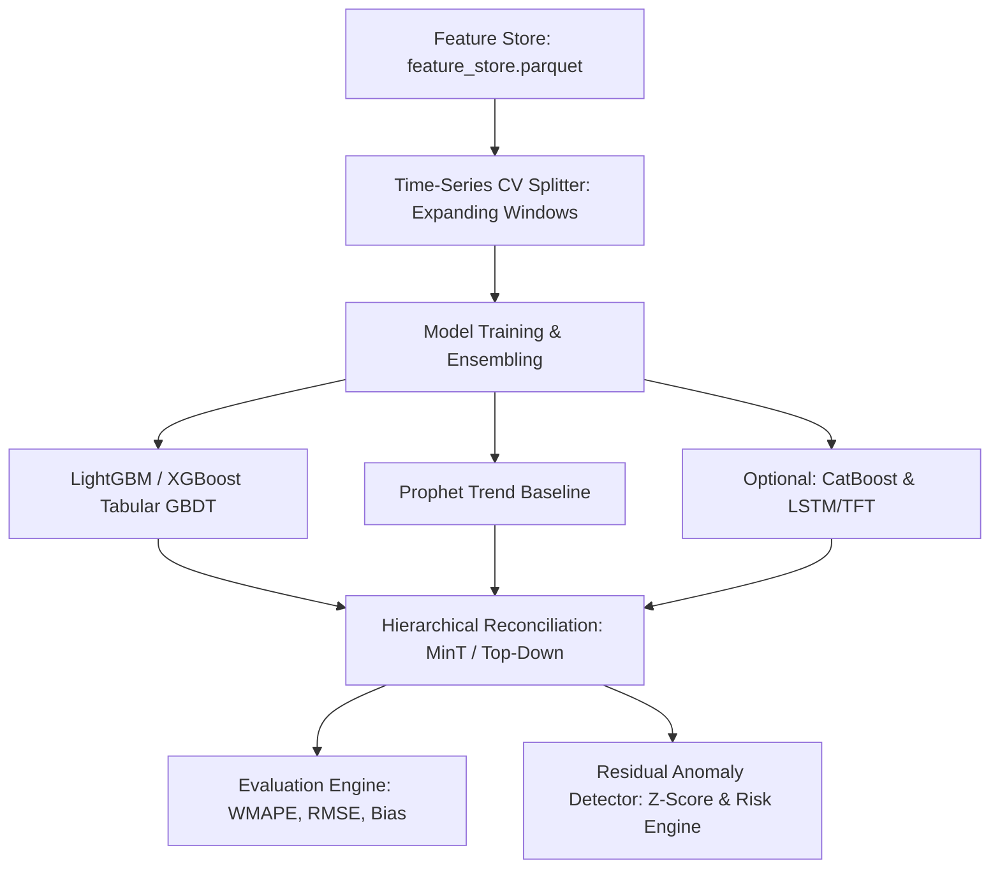

# Enterprise Demand Forecasting Engine Architecture & Model Plan

## 1. Executive Summary & Architecture Overview
This document specifies the complete architectural design, validation strategy, model selection, hyperparameter tuning, evaluation metrics, and edge-case handling for the Enterprise Demand Forecasting Engine.

The engine provides multi-horizon, hierarchical demand forecasts to drive downstream inventory safety stock optimization, replenishment scheduling, and supply chain risk detection.



---

## 2. Forecast Targets & Temporal Granularities

| Target Granularity | Forecast Horizon | Primary Operational Use Case | Update Frequency |
| :--- | :--- | :--- | :--- |
| **Daily** | $t+1$ to $t+28$ days | Short-term store replenishment, daily pick/pack scheduling, safety stock triggers | Daily |
| **Weekly** | $w+1$ to $w+12$ weeks | Medium-term warehouse capacity planning, supplier PO placement | Weekly |
| **Monthly** | $m+1$ to $m+12$ months | Long-term strategic budgeting, regional fulfillment expansion | Monthly |

---

## 3. Hierarchical Forecasting Structure & Reconciliation

The forecasting engine enforces consistency across three organizational hierarchy levels:

```
[Level 3: Region-Total]  <-- Top-level regional aggregate
        │
[Level 2: Category-Region] <-- Category aggregate per region
        │
[Level 1: SKU-Region]    <-- Bottom-level SKU item per region
```

- **Bottom-Up Reconciliation**: Bottom-level SKU-region forecasts are summed upward to category and regional totals.
- **Minimum Trace (MinT) Optimal Reconciliation**: Applies covariance-weighted optimal linear reconciliation to ensure coherent predictions where $\sum \hat{y}_{bottom} = \hat{y}_{top}$ without loss of accuracy.

---

## 4. Model Choice Specifications per Target

### 4.1 Tabular Gradient Boosted Trees (Primary Production Models)
- **LightGBM Regressor (`lightgbm`)**: Primary workhorse model. Handles high-cardinality categorical features natively, exhibits fast training speed on large-scale feature stores, and scales efficiently.
- **XGBoost Regressor (`xgboost`)**: Secondary tabular model. Utilizes exact depth-wise tree growth with strict L1/L2 regularization to prevent overfitting on noisy sales series.

### 4.2 Trend & Seasonality Baseline
- **Prophet (`prophet`)**: Univariate time-series model used as a benchmark for macro trend decomposition, yearly seasonality, and holiday curve fitting per top-level aggregate series.

### 4.3 Optional & Advanced Architectures
- **CatBoost Regressor (`catboost`)**: Optional model for handling unencoded categorical variables without target leakage.
- **LSTM / Temporal Fusion Transformer (TFT)**: Optional deep learning sequential architecture for capturing non-linear cross-series temporal interactions across extended horizons.

---

## 5. Strict Time-Series Cross-Validation Scheme

To prevent future lookahead leakage, model validation strictly enforces an **Expanding Window Cross-Validation** scheme over 5 folds, with a fixed 28-day validation horizon per fold.

```
Fold 1: |========= Train 2013-2016 =========|-- 28d Val --|
Fold 2: |=========== Train 2013-2017 ===========|-- 28d Val --|
Fold 3: |============= Train 2013-Mid2017 =============|-- 28d Val --|
Fold 4: |=============== Train 2013-Late2017 ===============|-- 28d Val --|
Fold 5: |================= Train 2013-Early2018 =================|-- 28d Val --|
```

- **Validation Horizon**: 28 consecutive days per fold.
- **Embargo / Purging**: 1-day embargo window between training set cutoff date and validation start date.
- **No Random K-Fold**: Random cross-validation is strictly forbidden due to autocorrelation.

---

## 6. Bayesian Hyperparameter Optimization (Optuna)

Hyperparameter tuning utilizes **Optuna** with the Tree-structured Parzen Estimator (**TPE**) sampler over a trial budget of **50 iterations** per model.

### Search Space Specifications:

| Model | Hyperparameter | Type | Search Range | Description |
| :--- | :--- | :--- | :--- | :--- |
| **LightGBM / XGBoost** | `n_estimators` | Integer | `[100, 1500]` | Number of boosting trees |
| | `max_depth` | Integer | `[3, 12]` | Maximum tree depth |
| | `learning_rate` | Float (log) | `[0.01, 0.20]` | Boosting shrinkage rate |
| | `subsample` | Float | `[0.5, 1.0]` | Row subsampling fraction |
| | `colsample_bytree` | Float | `[0.5, 1.0]` | Feature subsampling fraction |
| | `num_leaves` *(LGBM)*| Integer | `[15, 255]` | Max leaves per tree |
| | `reg_alpha` | Float (log) | `[1e-8, 10.0]` | L1 regularization parameter |
| | `reg_lambda` | Float (log) | `[1e-8, 10.0]` | L2 regularization parameter |

---

## 7. Model Evaluation Metrics

Models are evaluated using four complementary performance metrics:

1. **WMAPE (Weighted Mean Absolute Percentage Error)** *(Primary Metric)*:
   $$\text{WMAPE} = \frac{\sum_{t=1}^{N} |y_t - \hat{y}_t|}{\sum_{t=1}^{N} y_t} \times 100\%$$
   *Advantage*: Robust to zero-demand instances; weights errors by sales volume.

2. **RMSE (Root Mean Squared Error)**:
   $$\text{RMSE} = \sqrt{\frac{1}{N}\sum_{t=1}^{N} (y_t - \hat{y}_t)^2}$$
   *Advantage*: Penalizes large-magnitude forecast errors.

3. **MAPE (Mean Absolute Percentage Error)**:
   $$\text{MAPE} = \frac{100\%}{N}\sum_{t=1, y_t \neq 0}^{N} \left|\frac{y_t - \hat{y}_t}{y_t}\right|$$

4. **Forecast Bias (Percentage Mean Error)**:
   $$\text{Bias} = \frac{\sum_{t=1}^{N} (\hat{y}_t - y_t)}{\sum_{t=1}^{N} y_t} \times 100\%$$
   *Advantage*: Identifies systematic over-forecasting (positive bias) or under-forecasting (negative bias).

---

## 8. Residual-Based Anomaly Detection Engine

Forecast residual errors ($e_t = y_t - \hat{y}_t$) are continuously monitored to detect operational supply chain anomalies:

- **Residual Z-Score Computation**:
  $$Z_t = \frac{e_t - \mu_{\text{residual}}}{\sigma_{\text{residual}}}$$
- **Anomaly Detection Threshold**:
  - $|Z_t| > 3.0$: Flagged as a **Structural Demand Anomaly** (e.g. panic buying, sudden promotion, unannounced stockout).
- **Risk Engine Integration**: Flagged anomalies are passed directly to `src/risk/` to trigger automated risk scores and stockout alerts.

---

## 9. Strategies for Cold-Start & Intermittent Demand

### 9.1 Cold-Start Products ($< 30$ Days History)
- **Hierarchical Category Baseline Imputation**: Assign average demand curves of existing items in the same `category` and `region`.
- **Static Attribute Embeddings**: Use `unit_price`, `category`, and `weight_g` to infer initial demand via nearest-neighbor similarity.

### 9.2 Intermittent Demand Products ($> 50\%$ Zero Sales Days)
- **Croston’s Method / SBA (Syntetos-Boylan Approximation)**: Separate forecast into non-zero demand size ($z_t$) and inter-arrival interval ($p_t$):
  $$\hat{y}_t = \frac{\hat{z}_t}{\hat{p}_t}$$
- **Two-Stage Classifier-Regressor Pipeline**:
  - *Stage 1*: Binary classification model predicting $P(\text{sale} > 0)$.
  - *Stage 2*: Regression model predicting expected volume given sale $E[y \mid y > 0]$.
