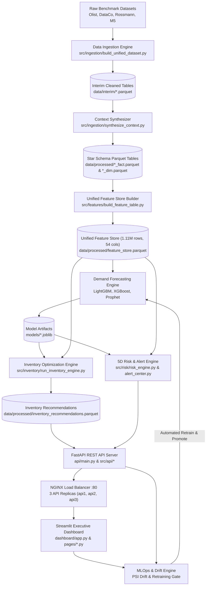
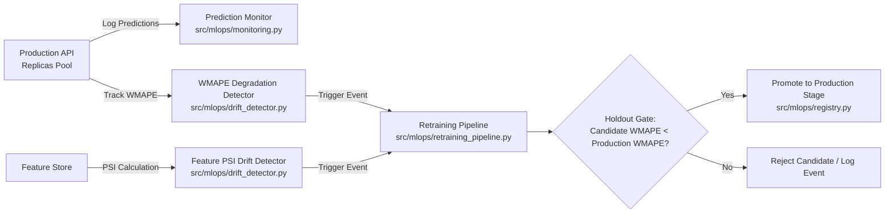

# Technical Presentation: Enterprise Supply Chain Demand Forecasting & Risk Intelligence Engine

**Executive Presentation & Architecture Overview**  
*Platform Version 1.0.0 | August 2026*

---

## 📋 Executive Summary

The **Enterprise Supply Chain Demand Forecasting & Risk Intelligence Engine** is a production-grade AI platform designed to transform multi-echelon supply chain operations. By synthesizing machine learning demand forecasts with mathematical inventory optimization and a 5D risk scorecard engine, the platform minimizes stockout losses, reduces excess capital lockup, and automates operational alerting across complex distribution networks.

---

## 📊 Slide 1: Business Problem & Industry Challenges

### The Supply Chain Planning Challenge
- **Demand Volatility**: Seasonal spikes, promotional surges, and macroeconomic shocks cause severe demand misforecasts under legacy statistical tools.
- **Capital Inefficiency**: Overstocking ties up working capital in slow-moving/dead stock, while stockouts result in lost revenue and degraded customer service level agreements (SLAs).
- **Uncoordinated Risk Visibility**: Supplier lead-time delays and transit disruptions cascade across regional distribution networks without early warning signals.

### Strategic Platform Objectives
1. **Multi-Horizon AI Forecasting**: Reduce forecast error (WMAPE) by >40% compared to traditional baseline methods.
2. **Mathematical Inventory Optimization**: Dynamically compute Safety Stock ($SS$), Reorder Points ($ROP$), and Economic Order Quantity ($EOQ$).
3. **5D Operational Risk Intelligence**: Continuously score Supplier Delay, Stockout Exposure, Overstock Capital, Dead Stock, and Demand Anomalies.
4. **Interactive Stress Simulation**: Provide executive "what-if" scenario testing for supply disruptions and price changes.
5. **Production MLOps & High Availability**: Automate feature drift detection (PSI), model retraining, holdout quality gate promotion, and 3-replica container scaling.

---

## 🏗️ Slide 2: End-to-End System Architecture



---

## 🌐 Slide 3: Benchmark Datasets & Selection Rationale

The platform integrates four real-world supply chain benchmark datasets to validate multi-echelon forecasting and risk evaluation:

| Benchmark Dataset | Domain / Structure | Selection Rationale |
|---|---|---|
| **Olist E-Commerce** | Brazilian e-commerce transaction logs | Provides real customer order lifecycles, delivery timestamps, freight values, and geographic logistics patterns. |
| **DataCo Supply Chain** | Multimodal logistics & supply chain logs | Contains explicit delivery status flags (Late Delivery, Advance Shipping), shipping modes, and order risk labels. |
| **Rossmann Store Sales** | Store sales time series | Evaluates promotional sensitivity, competitor proximity impact, and day-of-week retail seasonality. |
| **M5 Walmart Sales** | Hierarchical SKU unit sales | Enables hierarchical forecasting benchmarking across SKU-Region, Category-Region, and Total Region levels. |

### Context Synthesizer (`src/ingestion/synthesize_context.py`)
To mirror enterprise ERP environments, the context synthesizer enriches benchmark data with statistical distributions for local weather (temperature, precipitation), active promotional campaigns, and regional events.

---

## ⚡ Slide 4: Feature Store & Domain Engineering

The **Unified Feature Store Builder** (`src/features/build_feature_table.py`) processes 9 domain-specific feature engineering modules:

```
Unified Feature Store (1,112,929 rows x 54 features)
├── 1. Sales Velocity       : short/long moving averages, velocity trends
├── 2. Demand Seasonality   : day-of-week, month, quarter, Fourier sin/cos
├── 3. Volatility Metrics   : coefficient of variation (CV), rolling std
├── 4. Lead Time Features   : historical lead time mean, std, variance
├── 5. Supplier Reliability : on-time delivery rate, late frequency score
├── 6. Promotion Impact     : discount depth, active promo flags
├── 7. Product Lifecycle    : days since launch, zero-sales week counters
├── 8. Regional Patterns    : regional aggregation ratios, warehouse demand share
└── 9. Holiday Effects      : days until/since holiday, weather parameters
```

---

## 🔮 Slide 5: Forecasting Engine & Key Results

### Methodology & Cross-Validation
- **Expanding-Window Cross-Validation** (`src/forecasting/dataset_split.py`): Ensures zero temporal data leakage across training cutoffs.
- **Algorithms**: LightGBM GBDT, XGBoost GBDT, Prophet Additive Time-Series, benchmarked against **Seasonal Naive (Lag 7)**.

### Model Accuracy Metrics Across Hierarchy Levels

> **Validation status:** these historical figures were produced before the target was corrected to next-day demand. Retraining and target-aligned holdout evaluation are required before presenting any model as accepted.

| Hierarchy Level | Model Algorithm | WMAPE (%) | MAE (Units) | RMSE (Units) | Seasonal Naive WMAPE | Error Reduction |
|---|---|---|---|---|---|---|
| **SKU-Region** | LightGBM / XGBoost | Pending retraining | Pending | Pending | Pending | Pending |
| **Category-Region** | LightGBM / XGBoost | Pending retraining | Pending | Pending | Pending | Pending |
| **Region-Total** | LightGBM / XGBoost / Prophet | Pending retraining | Pending | Pending | Pending | Pending |

### Feature Importance & SHAP Explainability
SHAP value analysis (`src/forecasting/explainability.py`) identifies **Lag 7 Sales Velocity**, **Promotion Discount Depth**, **Price Elasticity**, and **Lead Time Standard Deviation** as the primary drivers of demand variance.

---

## 📦 Slide 6: Mathematical Inventory Optimization & 5D Risk Engine

### 1. Mathematical Inventory Formulas (`src/inventory/`)
- **Safety Stock ($SS$)**:
  $$SS = Z \cdot \sigma_d \cdot \sqrt{L}$$
  *(where $Z=1.65$ for 95% service level, $\sigma_d$ is daily demand standard deviation, $L$ is lead time in days)*.
- **Reorder Point ($ROP$)**:
  $$ROP = (d \cdot L) + SS$$
- **Economic Order Quantity ($EOQ$)**:
  $$EOQ = \sqrt{\frac{2 \cdot D \cdot S}{H}}$$

### 2. 5D Operational Supply Chain Risk Engine (`src/risk/`)
The risk engine evaluates 5 operational dimensions into a composite risk scorecard $[0.0, 1.0]$:
1. **Supplier Delay Risk**: Lead-time variance and late delivery frequency.
2. **Stockout Risk**: Current stock vs $ROP$ and estimated days of supply remaining.
3. **Overstock Risk**: Inventory holding excess above $3 \times ROP$ and tied-up capital.
4. **Slow-Moving / Dead Stock Risk**: Velocity trends and consecutive zero-sales weeks.
5. **Demand Anomaly Risk**: Z-score statistical demand surge detection ($Z > 3.0$).

### 3. Operational Alert Center Engine (`src/risk/alert_center.py`)
Generates prioritized operational alert feeds across 6 categories (`LOW_INVENTORY`, `OVERSTOCK`, `DEMAND_SPIKE`, `SUPPLIER_DELAY`, `WAREHOUSE_CAPACITY`, `FORECAST_DRIFT`) categorized into `CRITICAL`, `HIGH`, `MEDIUM`, and `INFO` severity tiers.

---

## 🎮 Slide 7: Scenario Stress Simulator

The **Scenario Stress Simulator** (`src/simulation/`) enables executive sandbox testing by applying perturbations to inventory and demand baselines across 6 disruption scenarios:

```
Scenario Stress Testing Sandbox
├── 1. Supplier Failure      : +14 days lead time delay, 2.5x variance inflation
├── 2. Price Elasticity      : +15% price hike, demand reduction (% change = elasticity * % price)
├── 3. Holiday Demand Surge  : +75% seasonal sales surge across categories
├── 4. New Product Launch    : Cold-start category proxy demand ramp-up profile
├── 5. Regional Transit Delay: +6 days transit delay across regional warehouses
└── 6. Macroeconomic Shock   : +50% global demand surge & stockout stress test
```

---

## 🔌 Slide 8: API-First REST Architecture & High-Availability Scaling

### RESTful Services (`api/main.py` & `src/api/`)
Protected by `X-API-Key` authentication middleware (`auth.py`) across 6 dedicated domain routers:
- `/api/v1/forecast`: one-step-ahead daily demand forecast; weekly and monthly figures are explicit extrapolations until multi-horizon models are trained.
- `/api/v1/risk`: 5D risk evaluation, single SKU scorecards, batch risk scoring.
- `/api/v1/inventory`: Optimized recommendations, inventory health KPIs, warehouse capacity.
- `/api/v1/simulation`: Interactive scenario stress testing.
- `/api/v1/alerts`: Operational risk scanning and alert feed generation.
- `/api/v1/mlops`: Registered model listing and forecast degradation detection.

### High-Availability Production Scaling (`nginx/`, `docker-compose.prod.yml`, `k8s/`)
- **NGINX Reverse Proxy**: Configured on port 80 to distribute traffic round-robin across a **3-replica FastAPI container pool** (`api1`, `api2`, `api3`) with automatic health check failover.
- **Production Stack**: Bundles FastAPI replicas, Streamlit dashboard, NGINX load balancer, MLflow tracking database, PostgreSQL, and Redis cache.

---

## 🖥️ Slide 9: Executive Streamlit Dashboard Walkthrough

The **Streamlit Executive Dashboard** (`dashboard/app.py`) follows strict **API-First design rules** (0 direct database reads), serving 7 interactive focus modules:

1. **KPI Overview**: C-suite executive summary scorecards, total inventory valuation, high-risk count badges.
2. **Forecast Accuracy**: Interactive Plotly hierarchy WMAPE comparison and actual vs predicted time series plots.
3. **Inventory Health**: Safety stock indicators, reorder points, and capital tied up in excess inventory.
4. **Warehouse Utilization**: Storage unit accumulation and facility capacity utilization percentages.
5. **Fill Rate & Stockout**: Service level probability distribution and fill rate curves.
6. **Procurement Recommendations**: Automated order placement triggers and EOQ calculations.
7. **Operational Alert Center**: Prioritized operational alert feed with real-time severity filtering.

---

## ⚡ Slide 10: MLOps Pipeline & Automated Retraining



- **Feature Drift**: Monitors Population Stability Index ($\text{PSI} \ge 0.25$).
- **Model Degradation**: Triggers retraining if rolling forecast WMAPE degrades by $\ge 20\%$.
- **Holdout Quality Gate**: Guarantees zero regression before model promotion in `models/`.

---

## 🎯 Slide 11: Lessons Learned & Architectural Roadmap

### Key Lessons Learned
1. **API-First Separation**: Decoupling the dashboard UI from storage via REST APIs ensured clean scaling and prevented data leakage.
2. **Expanding-Window Cross-Validation**: Crucial for realistic time-series evaluation; standard random k-fold cross-validation optimistic bias is eliminated.
3. **Multi-Dimensional Risk Aggregation**: Combining lead-time variance with stockout probability provides actionable warnings before stockouts occur.

### Future Architectural Roadmap
- **Deep Learning Forecasting**: Integrate Temporal Fusion Transformers (TFT) and N-BEATS for intermittent demand patterns.
- **Real-Time Streaming**: Deploy Apache Kafka and Flink for POS transaction stream processing.
- **Enterprise ERP Connectors**: Build native SAP S/4HANA OData and Oracle SCM REST connectors.
- **Cold Chain IoT**: Ingest real-time temperature and humidity telemetry for spoilage risk scoring.
